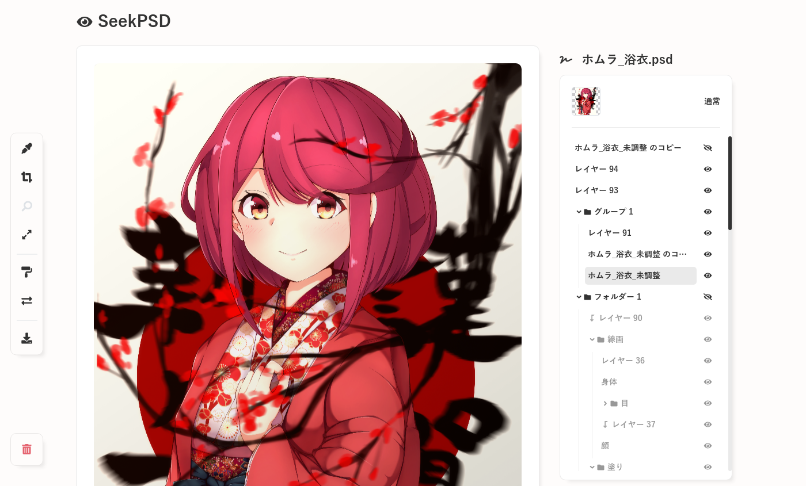

# <p align="middle">SeekPSD</p>

## Installation

```
> git clone git@github.com:nkihrk/seek-psd.git
> cd ./seek-psd
> yarn install
```

## SeekPSD

<p>
SeekPSD is a viewer app for PSD.
<br>
This project focusses on people practicing illustration who's trying to figure out layered PSDs created by 神絵師(Kami-eshi)
<br>
</p>

Used: <br>

```
Angular, ag-psd, file-saver, angular/flex-layout, angular-fontawesome
```

How to serve:

```
> yarn start
```

How to build:

```
> yarn build
```

<br>



# License

MIT Licence

Copyright (c) 2021 NkiHrk

Permission is hereby granted, free of charge, to any person obtaining a copy of this software and associated documentation files (the "Software"), to deal in the Software without restriction, including without limitation the rights to use, copy, modify, merge, publish, distribute, sublicense, and/or sell copies of the Software, and to permit persons to whom the Software is furnished to do so, subject to the following conditions:

The above copyright notice and this permission notice shall be included in all copies or substantial portions of the Software.

THE SOFTWARE IS PROVIDED "AS IS", WITHOUT WARRANTY OF ANY KIND, EXPRESS OR IMPLIED, INCLUDING BUT NOT LIMITED TO THE WARRANTIES OF MERCHANTABILITY, FITNESS FOR A PARTICULAR PURPOSE AND NONINFRINGEMENT. IN NO EVENT SHALL THE AUTHORS OR COPYRIGHT HOLDERS BE LIABLE FOR ANY CLAIM, DAMAGES OR OTHER LIABILITY, WHETHER IN AN ACTION OF CONTRACT, TORT OR OTHERWISE, ARISING FROM, OUT OF OR IN CONNECTION WITH THE SOFTWARE OR THE USE OR OTHER DEALINGS IN THE SOFTWARE.
